# 23 周路线图

> 总目标：23 周从"会写 JavaScript"到"能独立交付企业级 AI Agent 全栈应用"。每周一个主题，每周末一次复盘，每阶段一个里程碑项目。

学习总览图（各阶段核心技术与里程碑的推进关系）：

```mermaid
flowchart TD
    START([开始：会 JavaScript]) --> P1

    subgraph P1["阶段一 · 前端 + Node 底座（第 1–4 周）"]
        direction LR
        A1["W1<br/>TS 泛型 + Monorepo"] --> A2["W2<br/>门禁 + Next.js"] --> A3["W3<br/>Node + NestJS"] --> A4["W4<br/>PG + Prisma"]
    end
    P1 --> M1{{"里程碑 v1<br/>全栈 CRUD 跑通"}}

    M1 --> P2
    subgraph P2["阶段二 · 工程化 + 部署（第 5–8 周）"]
        direction LR
        B1["W5<br/>JWT / RBAC"] --> B2["W6<br/>Redis / 队列 / 幂等"] --> B3["W7<br/>Docker / CI"] --> B4["W8<br/>上云 / 监控"]
    end
    P2 --> M2{{"里程碑 v2<br/>上线 + 监控"}}

    M2 --> P3
    subgraph P3["阶段三 · Python + Agent 核心（第 9–13 周）"]
        direction LR
        C1["W9<br/>Python / Pydantic"] --> C2["W10<br/>FastAPI / SSE"] --> C3["W11<br/>LLM API / AI SDK"] --> C4["W12<br/>LangGraph / ReAct"] --> C5["W13<br/>多 Agent / HITL"]
    end
    P3 --> M3{{"里程碑 v3<br/>多 Agent 平台"}}

    M3 --> P4
    subgraph P4["阶段四 · RAG + 评估 + 安全（第 14–19 周）"]
        direction LR
        D1["W14<br/>RAG 基础"] --> D2["W15<br/>RAG 进阶"] --> D3["W16<br/>评估工程"] --> D4["W17<br/>记忆 / 上下文"] --> D5["W18<br/>MCP"] --> D6["W19<br/>安全 + 国产生态"]
    end
    P4 --> M4{{"里程碑 v4<br/>生产级加固"}}

    M4 --> P5
    subgraph P5["阶段五 · 整合 + 面试（第 20–23 周）"]
        direction LR
        E1["W20<br/>平台整合"] --> E2["W21<br/>生产化 / 成本"] --> E3["W22<br/>简历 / 复盘"] --> E4["W23<br/>面试冲刺"]
    end
    P5 --> END([毕业：速查卡 + 投递])
```

各阶段明细：

## 阶段一：企业级前端 + Node 全栈底座（第 1–4 周）

| 周   | 主题                              | 关键产出                       |
| ---- | --------------------------------- | ------------------------------ |
| 1    | TypeScript 进阶 + Monorepo 工程化 | 可运行的 monorepo 骨架         |
| 2    | 代码质量门禁 + 测试 + Next.js 路由 | lint/test/CI 配置 + dashboard  |
| 3    | Node.js 核心 + NestJS 入门        | 完整 CRUD API                  |
| 4    | PostgreSQL + Prisma + 全栈整合    | 🏁 里程碑 v1：全栈 CRUD 跑通   |

## 阶段二：后端工程化 + 数据 + 部署（第 5–8 周）

| 周   | 主题                          | 关键产出                     |
| ---- | ----------------------------- | ---------------------------- |
| 5    | 认证授权（JWT/RBAC）+ Web 安全 | 完整认证链路                 |
| 6    | Redis + 缓存 + 队列 + 幂等    | 缓存/锁/队列/幂等全套实战    |
| 7    | Docker + CI/CD                | 一键构建部署流水线           |
| 8    | 云部署 + Nginx + 可观测性入门 | 🏁 里程碑 v2：上线 + 监控    |

## 阶段三：Python + FastAPI + Agent 核心（第 9–13 周）

| 周   | 主题                                        | 关键产出                  |
| ---- | ------------------------------------------- | ------------------------- |
| 9    | Python 核心 + Pydantic                      | 类型安全的 Python 服务骨架 |
| 10   | FastAPI + SSE 流式响应                      | 流式对话端点 + 前端联调   |
| 11   | LLM API 基础 + 结构化输出 + Vercel AI SDK   | 多模型 CLI + AI SDK 对话页 |
| 12   | LangGraph + ReAct + 工具调用                | 手写裸 ReAct Agent        |
| 13   | 多 Agent 协作 + Human-in-the-Loop           | 🏁 里程碑 v3：多 Agent 平台 |

## 阶段四：RAG + 评估 + 记忆 + MCP + 安全（第 14–19 周）

| 周   | 主题                              | 关键产出                    |
| ---- | --------------------------------- | --------------------------- |
| 14   | RAG Pipeline 基础                 | 最小可用 RAG                |
| 15   | RAG 进阶 + 引用溯源               | Hybrid 检索 + 引用 UI       |
| 16   | Agent 评估工程                    | golden dataset + CI 评估门禁 |
| 17   | 记忆架构 + 上下文工程             | 带记忆的 Agent              |
| 18   | MCP 协议 + 工具生态               | MCP Server + 审批           |
| 19   | Agent 安全 + A2A + 国产生态       | 🏁 里程碑 v4：安全加固全链路 |

## 阶段五：全栈整合 + 生产化 + 面试冲刺（第 20–23 周）

| 周   | 主题                          | 关键产出            |
| ---- | ----------------------------- | ------------------- |
| 20   | 全栈整合 + 平台主链路         | 多租户 Agent 平台   |
| 21   | 生产化 + 可观测性 + 成本控制  | 监控/限流/成本面板  |
| 22   | 系统设计 + 项目复盘 + 简历    | STAR 文档 + 简历    |
| 23   | 面试冲刺                      | 八股笔记 + 速查卡   |

---

::: tip 手册与博客的关系
**手册**（《23 周每日执行手册》）负责"每天做什么"；**本博客**负责"怎么学会"。每天流程：读本日教程 → 跟着敲代码 → 完成手册任务 → 自测题检验。
:::
