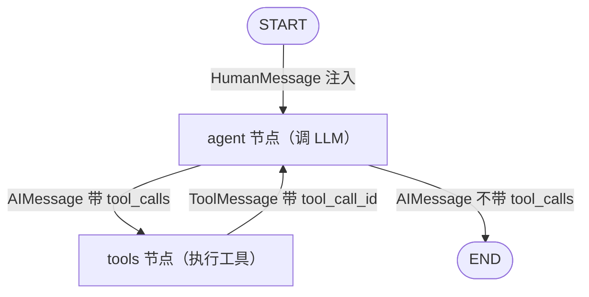

# 第 12 周 · Day 7：周复盘方法论，把 ReAct 循环画成一张图

> 手册任务：周复盘 + 整理。用 Excalidraw 画一张 ReAct 循环的状态图，写 300 字周记，当日产出：状态图 + 周记。
> 本篇解决的问题只有一个：这六天学的 LangGraph，合上教程后，你能不能自己把那个循环搭回来。

## 今日目标

1. 不看教程画出 ReAct 循环状态图，两个节点、四条边、三处消息标注，导出 PNG 存档
2. 按四段模板写一篇 300 字周记
3. 过一遍 10 题自检清单，答不上来的标记出来，回读 [本周](/week12/)对应的 Day 教程

## 概念讲解：为什么这周的复盘必须画图

第 1 周复盘画的是 monorepo，静态结构，目录摆在那，读一遍代码就能推出来（流程的源头在[第 1 周 Day 7](/week01/day7)）。这周不一样。LangGraph 的 ReAct 是循环，难点从来不在节点，节点就是两个普通函数。难点在边上：状态怎么长、条件怎么判、循环什么时候停。这些东西只在运行时存在，程序一停就看不见了。

所以本周最强的检验是画图。一张图画得出来，等于你在脑中手动模拟过一次执行：消息进来，agent 想一步，带 tool_calls 就去 tools，ToolMessage 回来再想，不带就出 END。画不出来，说明你记住的是 API 名字，不是流程本身。

复盘的底层逻辑不变：输出倒逼输入。看懂教程是识别，脱稿复现是提取，两回事。三种输出各逼一层：

| 输出方式 | 逼出什么 | 对应今天的产出 |
| --- | --- | --- |
| 画图 | 流程是否在脑中转得起来 | ReAct 循环状态图 |
| 写作 | 概念是否真的理解 | 300 字周记 |
| 自测 | 细节是否记牢 | 10 题自检清单 |

::: tip 流程照旧，内容换血
四段周记、10 题自检、git 收口，规矩和第 1 周一样。变的只是画的对象：目录结构换成了节点和边，静态依赖换成了会转的循环。
:::

## 核心知识

### 1. ReAct 状态图复盘法

先给文字版清单，照着画：

```text
节点（2 个，方框）：
  ① agent：调 LLM 的节点，负责"想"
  ② tools：ToolNode，负责"做"

特殊节点（2 个，椭圆）：
  START：入口，用户消息从这里注入
  END：出口，最终回答在这里交付

边（4 条，带箭头）：
  START → agent：固定边
  agent → tools：条件边，条件：AIMessage 带 tool_calls
  agent → END：条件边的另一分支，条件：不带 tool_calls
  tools → agent：固定边，回边，循环的灵魂

消息标注（3 处，写在边旁边）：
  agent → tools：AIMessage(tool_calls)
  tools → agent：ToolMessage（带 tool_call_id）
  agent → END：AIMessage（无 tool_calls，即最终回答）
```

画的时候抓三个层次：**节点是角色，边是控制流，消息标注是数据流**。全图只有一处分叉，从 agent 出来的那两条边，两个条件正好互补。分叉画对了，循环的出口就画对了。

mermaid 版，可直接渲染，手稿画完后拿它对照：



Excalidraw 手画要点，五条：

1. 布局：agent 放中间偏左，tools 放右边，START 在顶上，END 在底下。循环要让人一眼看出是个圈
2. START 和 END 用椭圆，和方框节点区分开，它们不是函数，是图的边界
3. agent 出两条边，分别标"有 tool_calls"和"无 tool_calls"，这是全图唯一的分叉
4. tools → agent 的回边绕外圈画，别和 agent → tools 重叠。这条边就是 while 循环
5. 消息类型用小一号的字标在边旁，谁产生什么消息，一眼可查

::: warning 画不出来别对着教程抄
先凭记忆画，卡住了翻本周 Day 教程确认，然后合上继续。对着教程抄出来的是复制，不是复盘。
:::

画完导出 PNG，命名 `week12-react-loop.png`，`.excalidraw` 源文件一起留。下周要加 human-in-the-loop 或多 agent 时，先改这张图再动手。

### 2. 300 字周记模板

四段不变：最大收获、卡得最久、还含糊、下周前补。第 12 周示例，照这个密度写：

```text
① 本周最大收获：LangGraph 的 agent 不是什么神秘循环，就是一张状态图。
agent 节点调模型，tools 节点跑工具，条件边看有没有 tool_calls，决定回
tools 还是出 END。裸 ReAct 十几行就跑通，循环是图自己转出来的。
② 卡得最久：节点明明返回了消息，历史总只剩最后一条。查了半天，发现
State 的 messages 没挂 add_messages reducer，更新走了覆盖语义。补上
Annotated 之后历史立刻完整。
③ 还含糊：checkpointer 的快照里到底存了什么；SqliteSaver 的表结构。
④ 下周前补：在裸 ReAct 里每轮打印 state["messages"]，亲眼看列表怎么
长；再读一遍 persistence 文档。
```

### 3. 第 12 周知识自检清单

规则同第 1 周：每题先口头回答，说完整了再点开答案对照。

**问题 1：LangGraph 四个核心概念，StateGraph、State、Node、Edge，各自管什么？**

::: details 答案
StateGraph 是骨架，add_node、add_edge 之后 compile 成可运行的应用。State 是共享内存，通常用 TypedDict 描述，所有节点读写同一份。Node 是干活的函数，接收 state，返回更新。Edge 是控制流，普通边固定指向，条件边按 state 动态选路。一句话：图是骨架，状态是内存，节点是计算，边是路由。
:::

**问题 2：State 里的 messages 为什么要写 `Annotated[list, add_messages]`，裸写 list 不行吗？**

::: details 答案
Annotated 的第二个参数是 reducer，规定这个字段怎么合并节点的返回值。add_messages 是追加语义，新消息接在列表尾部，历史不丢。裸写 list 没有 reducer，字段走覆盖语义，后写覆盖先写，同一轮多个节点同时写还会直接抛 InvariantError。覆盖一旦发生，模型下一轮只能看到最后一条消息，多轮循环立刻断掉。
:::

**问题 3：节点函数返回值的语义是什么？必须返回整个 state 吗？**

::: details 答案
返回的是部分更新。节点返回一个 dict，只写要变化的 key，框架把返回值交给对应字段的 reducer 去合并，没提到的 key 原样保留。不需要也不应该返回整个 state，全量返回容易把不该动的字段弄脏。
:::

**问题 4：条件边的 router 函数有什么要求？**

::: details 答案
接收 state 一个参数，返回下一个节点的名字（字符串）或 END。返回的名字必须已经 add_node 注册过，否则运行时报错。典型实现：看 state["messages"][-1].tool_calls，非空返回 "tools"，空返回 END。
:::

**问题 5：recursion_limit 默认值是多少？管什么用？**

::: details 答案
默认 25。它限制一次 invoke 最多执行多少个 superstep，一轮节点执行算一步，作用是给循环兜底：模型反复调工具停不下来时不会无限烧钱，超出直接抛 GraphRecursionError。通过 config 里的 {"recursion_limit": 数字} 调整。真报了这个错，先查模型为什么不肯收尾，再考虑调大。
:::

**问题 6：ReAct 全称是什么？循环什么时候终止？**

::: details 答案
Reasoning and Acting，推理与行动交替：模型想一步，调一次工具，拿到结果再想。终止条件只有一个，模型返回的 AIMessage 不带 tool_calls，说明它认为信息够了，直接给最终回答，此时 router 把流引向 END。
:::

**问题 7：ToolMessage 的 tool_call_id 和什么对应？对不上会怎样？**

::: details 答案
和 AIMessage.tool_calls 里对应那次调用的 id 一一对应。模型一次可能并行发多个 tool_call，结果靠 id 配对，模型才知道哪条 ToolMessage 回应哪次调用。缺了或对不上，模型接口直接报错，OpenAI 就要求每个 tool_call 后面都跟着 id 匹配的 ToolMessage。
:::

**问题 8：@tool 装饰一个函数，哪三样东西是给 LLM 看的？**

::: details 答案
函数名变成工具名，docstring 变成工具描述，参数的类型注解变成参数 schema。这三样是 LLM 能看到的全部，它据此决定何时调用、传什么参数。函数体只在执行时跑，LLM 看不见。所以 docstring 写得含糊，工具逻辑再对也调不准。
:::

**问题 9：thread_id 是干嘛的？**

::: details 答案
checkpointer 按 thread 隔离存储状态，thread_id 放在 config 的 configurable 里，指定当前是哪个会话。同一 thread_id 的多次 invoke 读写同一份状态，消息历史跨轮次累积，这就是记忆的来源。换一个 thread_id 就是一份全新的空白状态，多会话互不干扰。
:::

**问题 10：MemorySaver 和 SqliteSaver 差在哪？怎么选？**

::: details 答案
都是 BaseCheckpointSaver 的实现，接口一样，差别在存哪。MemorySaver 存进程内存，重启即丢，零配置，适合开发调试。SqliteSaver 落到本地 .db 文件，重启后状态还在，适合单机长期跑。开发期用 Memory，要持久化换 Sqlite，多实例生产再上 PostgresSaver，切换只改 compile(checkpointer=...) 这一个参数。
:::

::: tip 全对也别跳过复盘
10 题全对说明概念及格，不等于流程内化。图和周记两件事做完，本周才算收口。
:::

## 动手任务：完成本周复盘

五步，预计 60 到 90 分钟。

**第一步：画 ReAct 状态图（20 分钟）**

关掉教程，打开 excalidraw.com，对照文字清单凭记忆画：两个方框节点、两个椭圆边界、四条边、三处消息标注。卡住翻本周 Day 教程确认，合上继续。

**第二步：导出存档（5 分钟）**

菜单点 Export 导出 PNG，命名 `week12-react-loop.png`，`.excalidraw` 源文件一起留。

**第三步：写 300 字周记（20 分钟）**

四段模板，对照示例的密度。第三段"还含糊"别敷衍，它就是下周的补课清单。

**第四步：做自检清单（15 分钟）**

10 题逐个口头回答，答不上的记下题号，回读对应 Day 的教程。回读也是复盘的一部分，不丢人。

**第五步：git 提交整理（15 分钟）**

本周代码和文档分开提交，收口打 tag。老规矩，不去改历史。

```bash
# 代码一个提交，文档一个提交：
git add week12/
git commit -m "feat(week12): 裸 ReAct 接入条件边与 checkpointer"
git add docs/
git commit -m "docs(week12): 周记与 ReAct 状态图存档"

# 打标签收口：
git tag week12-done
```

## 常见踩坑

**状态图画成了调用链。** 一条线从 START 直通 END，没有回边。对照裸 ReAct 的代码，tools 之后有一条 add_edge 回 agent，循环就靠这条边转，漏了它，图是死的。

**条件标注写漏一半。** 只画了"有 tool_calls 去 tools"，忘了"无 tool_calls 去 END"。两个条件互补，缺了出口，循环永远停不下来，正好对应 recursion_limit 报错的那种死循环。

**周记写成 API 清单。** "本周学了 StateGraph、条件边、Checkpointer"，这是目录不是周记。四段里最值钱的是"卡得最久"和"还含糊"，写不出这两段，多半是在回避。

**自检先看答案。** 题还没想就点开答案，一看都会。先口头说完整再对照，识别和提取之间隔着的鸿沟就在这。

## 延伸阅读

- [LangGraph 官方文档](https://langchain-ai.github.io/langgraph/)：对照你画的状态图去读 How-to 部分，重点看 add_conditional_edges 和 persistence 两节
- [ReAct 论文](https://arxiv.org/abs/2210.03629)：Yao 等人 2022 年提出，全名 Synergizing Reasoning and Acting in Language Models，"想一步、做一步"的原始出处
- [Excalidraw](https://excalidraw.com)：和第 1 周同一个工具，这周画的是会转的图

下周开始前，把周记第四段留的补课动作清掉。第 12 周到此收口。
