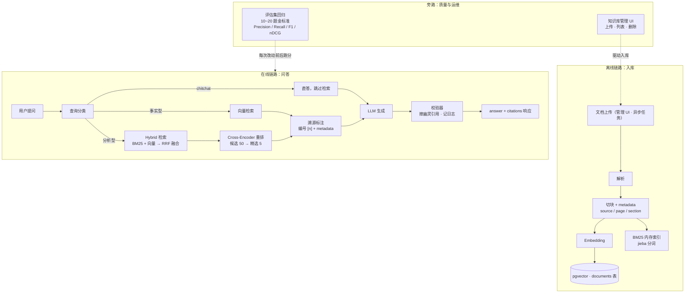

# 第 15 周 · Day 7：周复盘——把六天的增量合成一张图、一本账

> 手册任务：周复盘 + 整理。整理 RAG Pipeline 架构图，写 300 字周记，当日产出：架构图 + 周记。
> 本篇解决的问题只有一个：这周六天都在往 RAG 流水线上加东西，怎么确认这些增量在你脑中连成了整体，而不是六个互不相识的补丁。

## 今日目标

1. 不看教程画出 RAG Pipeline 架构图 v2（离线、在线、旁路三条链路），导出 PNG 存档
2. 把 Day 1、Day 2、Day 5 的对比数字汇总成一张总账表，能对着表说出每个优化换来什么
3. 按四段模板写 300 字周记，过一遍 10 题自检清单

## 概念讲解：第 15 次复盘，特殊在哪

复盘的方法第 1 周 Day 7 就定下了：画图、周记、自测三板斧，忘了的先回[第 1 周](/week01/)补课。所以今天不重复方法论，讲本周的特殊性。

第 14 周的最小 RAG，一张图三个框画完。这周呢？Day 1 检索从一路变两路，Day 2 排序加一道关卡，Day 3 入口加一层路由，Day 4 出口长出 citations，Day 5、Day 6 旁边又挂上评估集和管理界面。增量一多，脑子里最容易出现"补丁化"：每个模块单独都懂，串起来讲不清谁先谁后、数据从哪流到哪。

检验标准给一个具体的：指着图上任意两个模块，能不假思索说出它们之间流的是什么。比如"切块"和"引用卡片"之间，流的是 metadata——入库时写进、检索时带出、响应时兑现。答不上的地方，就是还没连成结构的地方。

所以本周两件产出的权重比以往更重：

| 产出 | 检验什么 |
| --- | --- |
| 架构图 v2 | 六个增量是否整合成一条完整流水线 |
| 总账表 | 每个优化是否留下数字证据 |

第二件多说一句。Day 1 你跑过三列命中率，Day 2 跑过重排前后对比，Day 5 用指标算过优化前后，三张表散在三篇教程里，不合账，这些数字一周后就忘光了。今天把它们收进一张总账表，以后每做一次优化就加一行，这张表会变成整个项目的优化日志。

## 核心知识

### 1. RAG Pipeline 架构图 v2

先给 mermaid 版，贴进 [mermaid.live](https://mermaid.live) 直接渲染：



用 Excalidraw 手画的话，照这份要素清单来：

```text
三条链路，用三个色块区域圈开：
  离线（入库）：文档上传 → 解析 → 切块 + metadata → Embedding → pgvector；
               切块同时喂 BM25 内存索引（jieba 分词）
  在线（问答）：提问 → 查询分类 → 三条分支：
               chitchat → 直答，不碰知识库
               事实型 → 向量检索 → 溯源标注
               分析型 → Hybrid（BM25 + 向量 → RRF）→ 重排 → 溯源标注
               三条汇合 → LLM → 校验器 → answer + citations 响应
  旁路（运维）：评估集回归挂在在线链路旁边，每次改动前后各跑一遍；
               知识库管理 UI 驱动离线链路（上传、列表、删除）

五个关键数字，标在对应节点旁：
  召回宽度 50 ／ 最终 top 5 ／ RRF 的 k=60 ／ 降级阈值（自己校准的值）／ 评估集题数

一条容易漏的隐形边：
  切块 → 溯源标注，流的是 metadata：入库时写入、检索时带出、响应时兑现。
  画成虚线，提醒自己这条数据流横跨离线和在线两条链路
```

层次还是那三层：节点是模块，边是数据流，标注是参数。画完对照第 14 周那张 v1，把新增部分用红框圈出来：双路检索、RRF、重排、分类路由、citations、旁路两组件。圈出来的就是本周增量，也是这张图的版本差异。图命名 `week15-rag-pipeline.png`，和 v1 放同一目录——架构图按周版本化，它就是项目的成长档案。

::: warning 老规矩，别对着教程抄
先凭记忆画，卡住翻 Day 1 到 Day 6 对应的教程确认，合上继续画。抄出来的图没有复盘效果，识别和提取的区别第 1 周讲透了。
:::

### 2. 本周优化总账表

三张散落的对比表，收成一张（表中是教程的典型格局，以你自己复跑的数字为准）：

| 优化动作 | 改前 | 改后 | 变化 | 出处 |
| --- | --- | --- | --- | --- |
| 单路向量 → Hybrid 双路 | Hit@3 6/10 | 10/10 | +40 个百分点 | Day 1 |
| 只召回 → 召回 + 重排 | top3 命中 6/10 | 9/10 | +30 个百分点 | Day 2 |
| 固定链路 → Adaptive 路由 | 闲聊题也跑全链路 | chitchat 直答，事实型走向量，分析型走 Hybrid + 重排 | 均摊延迟和调用成本下降 | Day 3 |
| 裸答案 → citations 分离 | 结论无出处，幻觉没法核验 | 每个结论可回溯到文件和页码 | 幽灵引用有校验器兜底，审计有抓手 | Day 4 |
| 体感 → 指标评估 | 只能说"感觉变好了" | Precision / Recall / F1 / nDCG 基线 | 每次改动有分可对 | Day 5 |

读表的方法：每行应该是一个动作换一个可测量的变化。前两行是命中率，直接可比；后三行的收益不落在命中率上，但 Day 5 建好的评估集就是为了让它们也能量化——比如路由优化前后各跑一遍指标和延迟，数字就出来了。哪一行你填不出自己的数字，说明那天的工作还没收口进评估集，这行就是下周的补课项。

这张表还有个隐藏用法：它本身就是 Day 5 评估方法论的日常化。评估不是周五做一次的仪式，是每次动刀前后各跑一遍的习惯。

### 3. 300 字周记

四段模板不变：最大收获、卡得最久、还含糊、下周前补。第 15 周示例，照这个密度写：

```text
① 本周最大收获：RAG 的检索不是一个函数，是一条流水线。召回求快（双塔
加 BM25，吃预计算红利）、重排求准（交叉编码器只审 50 条）、路由求省
（闲聊不进库）、出口求信（citations 可回溯）。每个环节只干自己最擅长
的一件事，便宜模型干重活，贵模型干细活。
② 卡得最久：中文语料喂 rank_bm25 忘了 jieba 分词，BM25 路全零分，以
为库坏了查半天。语料和查询必须过同一个 tokenize，这条铁律刻进脑子了。
③ 还含糊：nDCG 的折损和归一能看懂、不会自己推；问题判成事实型还是分
析型的边界拿不准。
④ 下周前补：评估集从 10 题扩到 20 题，补两道库外题，重跑一轮指标，把
总账表后三行也填上自己的数字。
```

### 4. 第 15 周知识自检清单

规则不变：每题先口头回答，说完整了再点开对照。说不出的记下题号，回读对应 Day 的教程。

**问题 1：BM25 打分的直觉是什么？两个核心信号各管什么？（Day 1）**

::: details 答案
词频乘逆文档频率，外加长度归一化。词频（TF）：查询词在文档里出现越多越相关，但增益有饱和，出现 30 次不会比 3 次相关十倍，堆词刷分无效；逆文档频率（IDF）：词在全体语料越稀有区分度越高，"的"毫无区分度，"ORDER-2024"一锤定音。长度归一化防长文档靠字数占便宜。一句话：稀有词的重合度。
:::

**问题 2：RRF 为什么免调参？对比加权融合说明。（Day 1）**

::: details 答案
加权融合有两重不确定性：余弦分挤在 0 到 1、BM25 分上不封顶，量纲不可比，得先归一化，归一化方式有好几种都影响结果；归一完还得调权重 α，语义题想要 α 大、关键词题想要 α 小，没有先验答案。RRF 只用排名不用分数：score(d) = Σ 1/(k + rank)，天然规避量纲问题；唯一参数 k 有原论文验证过的稳健默认值 60，实践里基本不用动。
:::

**问题 3：双塔和交叉编码器，快与慢的根源差在哪？（Day 2）**

::: details 答案
差在输入方式。双塔把 query 和文档分别独立编码，两边互相看不见，文档向量可离线预计算，查询时只编码一次 query 再做 ANN，所以快；代价是几百字压成一个向量，压缩有损，交互只剩最后算一次余弦，所以粗。交叉编码器把两段拼接后一起送进模型，attention 让 token 级比对发生在每一层，所以准；但每个 query 要和每条候选拼成一对、各跑一次完整前向传播，且永远无法预计算，所以快不了。
:::

**问题 4：为什么是「召回 50 → 精排 5」两阶段，而不是向量直接取 top5，或者全库精排？（Day 2）**

::: details 答案
直接取 top5 依赖召回模型的排序质量，相关文档常卡在 4 到 10 名被截掉。全库精排意味着每个 query 对全库每条候选做一次前向传播，10 万条 chunk 就是 10 万次，分钟级延迟不可用。两阶段让便宜模型干重活（10 万 → 50）、贵模型干细活（50 → 5），延迟可控，排序质量接近全库精排。
:::

**问题 5：chitchat 类问题为什么不进检索，直接回答？（Day 3）**

::: details 答案
"你好""谢谢"这类问题的答案不依赖知识库，检索是白跑：白付一次双路检索加重排的延迟和算力，检回来的 chunk 和问题无关，塞进 Prompt 反而干扰生成。分类器判成 chitchat 就短路直答，省时、省钱、答案还更干净。
:::

**问题 6：nDCG 和 Precision 差在哪？各自适合什么场景？（Day 5）**

::: details 答案
Precision@K 只数"捞回来的 K 条里有几条相关"，二元判断，不分先后。nDCG 多算两件事：相关度可以分级，不是只有 0 和 1；排得越靠前贡献越大（名次有折扣），最后除以理想排名的得分归一到 0 到 1。只关心"相关文档在不在前 K"用 Precision；在意"最相关的必须排最前"——比如进 Prompt 的顺序会影响生成质量——用 nDCG。
:::

**问题 7：评估用的金标准（golden set）怎么建？（Day 5）**

::: details 答案
一组"问题 + 应命中的目标切块"对。题目优先收真实用户问法，别自己闭门造句；类型要覆盖：语义类、关键词类，再补几道知识库外的题考降级。标注时给每题标唯一支撑切块，命中片段选目标切块里独有的文字，别选满库都是的词，不然命中判定虚高。10 到 20 题起步，建好就冻结，作为每次改动的回归基准。
:::

**问题 8：citations 由后端构造、和 answer 分字段返回，好处是什么？（Day 4）**

::: details 答案
三个好处。一是防幻觉：模型只通过 [n] 标记表达"用了哪几条"，source、page 由后端从检索结果的真 metadata 映射回去，模型没机会编一个看起来合理的页码；二是前端要的 snippet、score 本来就不在正文里，靠正则从正文抠引用两头崩，格式一变就失配；三是空数组有明确语义"知识库未覆盖"，前端拿到空列表直接走降级展示，不用判空猜含义。
:::

**问题 9：知识库上传为什么做成异步任务，而不是在接口里同步处理完再返回？（Day 6）**

::: details 答案
解析、切块、逐块 Embedding、写库是秒级到分钟级的重活，大文件更久。同步做会让 HTTP 请求超时、上传界面一直卡在转圈，失败还不好重试。异步的做法：接口收到文件立即返回任务标识，后台慢慢处理，前端轮询进度，单个文档失败不影响其他任务，还能重试。
:::

**问题 10：删除一篇文档，要清哪些地方？（Day 6）**

::: details 答案
原则一句话：入库这个动作写过的每一路存储，删除时都要清一遍。具体到本周的栈：documents 表里这篇文档的所有切块行（pgvector 方案里向量和切块同一行，随行一起删）；BM25 内存索引要重建，它的词频和 IDF 统计基于建库那一刻的语料，不清就悄悄漏召回；最后刷新管理 UI 的文档列表，有任务状态记录的也一并清。少清一路，库里就多一份残留脏数据。
:::

::: tip 10 题全对也别飘
全对说明本周及格，不说明可以跳过复盘。图、总账表、周记三件产出做完，本周才算收口。
:::

## 动手任务：完成本周复盘

五步，预计 60 到 90 分钟。

**第一步：画架构图 v2（20 分钟）** 关掉教程，打开 excalidraw.com，对照要素清单凭记忆画。顺序建议：先画三个链路分区框，再填节点和箭头，最后补五个数字标注。卡住翻 Day 1 到 Day 6 的教程确认，合上继续。

**第二步：导出存档（5 分钟）** 导出 PNG，命名 `week15-rag-pipeline.png`，和第 14 周的 v1 放同一目录，红框标出新增部分。`.excalidraw` 源文件留着，下周继续往上加。

**第三步：填总账表 + 写周记（25 分钟）** 先把总账表"改前改后"两列换成自己复跑的数字，填不出的行记下来，它们是下周的补课项。然后按四段模板写周记，"还含糊"那段别敷衍。

**第四步：自检清单（15 分钟）** 10 题逐个口头回答。答不上来的记下题号和对应 Day，回读该 Day 教程的对应小节，回读也是复盘的一部分。

**第五步：git 提交整理（15 分钟）** 本周产出以代码为主：`hybrid_retrieval.py`、`rerank.py`、Adaptive 路由、评估脚本、管理 UI 前后端。先检查它们是不是都在版本控制里，练习目录里躺着的散文件收进来，再按"一个提交只做一件事"分开提交，最后打 tag 收口：

```bash
git add hybrid_retrieval.py rerank.py
git commit -m "feat(rag): Hybrid 检索与重排模块"
git add eval/
git commit -m "feat(rag): 检索指标评估脚本"
git tag week15-done
```

## 常见踩坑

**图画成第 14 周的复刻。** 三个框加一个箭头就收工，双路、重排、路由、citations 一个没画。v2 的意义就在增量，画完先自查：本周六个模块在图上是不是各占一个位置？

**只画在线链路。** 离线入库和旁路最容易被漏，但检索质量的地基在离线（切块质量决定检索上限），可持续性在旁路（评估集守住每次改动）。三条链路缺一条，这张图就不配叫完整。

**总账表照抄教程数字。** 6/10 变 10/10 是典型语料跑出的格局，直接抄进表里等于没算账。必须换成自己复跑的数字，哪怕格局一致，复跑本身就是一次回归测试。

**周记写成功能清单。** "周一学了 Hybrid，周二学了重排"是目录不是周记。四段里最值钱的还是"卡得最久"和"还含糊"，写不出这两段，多半是在回避。

## 延伸阅读

- [mermaid.live](https://mermaid.live)：本文的 mermaid 架构图贴进去直接渲染，可导出 SVG 或 PNG 存档
- [Reciprocal Rank Fusion 原论文（SIGIR 2009）](https://dl.acm.org/doi/10.1145/1571941.1572114)：k=60 的出处。流水线上最小的零件，也是被工业界引用最多的一个
- 复盘方法论全文见[第 1 周 Day 7](/week01/)：识别与提取、输出倒逼输入，那套逻辑今天原样适用

下周开始前，把周记第四段留的动作清掉，尤其是"给总账表后三行填上自己的数字"。第 15 周到此收口。
