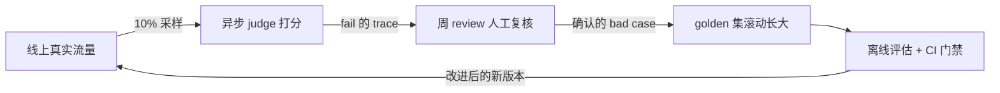
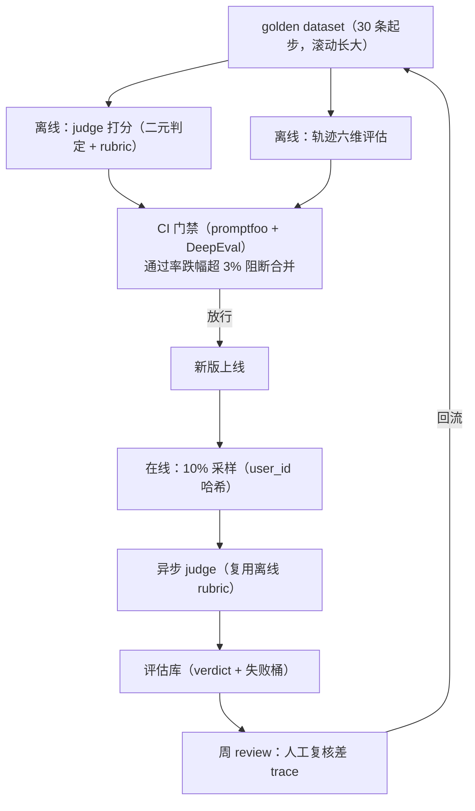

# 第 16 周 · Day 7：周复盘——把六天的评估零件拼成体系，设计在线评估

> 手册任务：周复盘 + 整理。设计在线评估方案（10% 流量采样 + 差 trace 回流数据集），写周记，当日产出：在线评估设计文档 + 周记。
> 本篇解决的问题：Day 1 留的那半句话——「在线评估：真实但贵且慢，Day 7 再设计方案」。今天把它补上。离线管已知，在线管未知，两个轮子咬上才是飞轮。

## 今日目标

1. 画得出本周评估体系总图：golden 集怎么喂离线评估、CI 门禁怎么卡合并、在线采样怎么把差 trace 送回来
2. 按模板写出一份在线评估设计文档：采样率 10% 的依据、打分链路、差 trace 回流机制
3. 按四段模板写 300 字周记，过 10 题自检，答不上的回读对应 Day 的教程

## 概念讲解：为什么在线评估是最后一块拼图

复盘的方法第 1 周 Day 7 已经讲透：识别不是提取，输出倒逼输入，画图、周记、自检三件套本周照用，不清楚的回[第 1 周教程](/week01/)。今天概念部分讲另一件事：你花六天搭起来的离线评估，天花板在哪。

回到 Day 1 的行业数字：89% 的团队有可观测性，52% 做离线评估，只有 37% 做在线评估。当时没展开的一个问题是：为什么在线比离线又少 15 个百分点？先把离线评估的三个天生盲区摆出来，答案就在里面。

第一，**分布会漂**。golden 集是从历史日志挑的，用户下周问什么你今天不知道。新商品上架、新促销规则、新的套话方式，golden 集里全没有。离线通过率 90%，挡不住线上新花样翻车。

第二，**覆盖永远是抽样**。30 条扩到 300 条，对线上每天成百上千种问法仍然是小样本。离线分数只是「已知分布内的分数」，它的置信边界就是你的数据集边界。

第三，**改进来源会枯竭**。数据集固定后，迭代只剩「已知的失败模式」。新的失败没人送进来，飞轮停转，你的通过率会在 90% 附近横盘，而线上体验继续烂在你不知道的地方。

在线评估补的就是这三个洞：真实流量持续采样打分，新失败自动浮出水面，差 trace 回流成新的 golden case。分工一句话：**离线保证已知的不再犯错，在线保证未知的不断变成已知**。

代价是它要动线上系统：采样埋点、异步链路、judge 成本、回流的人工流程，每一件都是工程活。这就是 37% 的由来，也是今天要用一份设计文档把它拆清楚的原因。而写文档这个动作本身也是复盘：它逼你把六天的零件（golden 集、judge、轨迹评估、门禁）在脑子里装配一遍，装不上的地方，就是你还没真懂的地方。

## 核心知识

### 1. 在线评估设计文档模板

文档四部分，逐块讲清「写什么、为什么」。

**第一部分：采样策略。** 采样率 10%，这个数是算出来的，不是拍的。

算样本量：假设日请求 1000 条，10% 采样就是日 100 条，一周 700 条。通过率在 0.85 附近时，700 条样本的标准误约 1.3 个百分点，95% 置信区间宽 ±2.6 个百分点。含义：周通过率跌 3% 以上，基本不可能是采样噪声，一定是真变化。这正好和 Day 6 门禁阈值 3% 同量级，两套数字是咬合的。

算成本：judge 一条 trace 一次 LLM 调用。全量采样等于把推理成本近乎翻倍，10% 采样把这块压到零头，信息量却够用。

采样方式：按 user_id 哈希取模（`hash(user_id) % 10 == 0` 进采样组），不按请求随机。两个理由：同一用户稳定地进或不进采样组，周与周之间的用户分布可比；以后想做采样组和非采样组的对照，天然有控制组。

调整原则一句话：**周样本量撑起的置信区间宽度，要小于你关心的最小变化幅度**。日流量 200 条以下的项目可以全量，日流量 10 万以上的 1% 就够。10% 是「日千级流量」这个档位的解，不是教条。

**第二部分：打分链路。** 请求→采样→异步 judge→入库，四段：

1. 用户请求正常走 Agent，业务主链路一行不改
2. 网关或回调层按 user_id 哈希给 10% 的请求打采样标记
3. 被标记的完整 trace（用户输入、工具调用轨迹、最终回复）写入队列，写完就放行，不等打分
4. 异步 worker 消费队列，用 Day 2 校准过的 judge prompt（temperature 0、二元判定、JSON 输出）逐条打分，verdict、reason、失败桶写入评估库，每周聚合成通过率和桶分布

两条铁律：judge 挂了不能影响业务，异步隔离，失败重试进死信队列；线上 judge 必须复用离线校准过的同一份 rubric，不许在线另写一套——两套标准等于没有标准。

**第三部分：差 trace 回流。** 数据集滚动长大的机制：

1. 每周固定时间（比如周五下午）从评估库捞本周 judge 判 fail 的 trace
2. 人工复核。judge 有误判，Day 2 的混淆矩阵早提醒过你，必须人确认哪些是真 bad case，顺手按五桶归类
3. 确认的改写成 golden 格式：query 原样保留，expected_behavior 写行为不写文案，编号从新段起（比如 gd-101）
4. golden_dataset v0 → v1，进 git；数据集变了，judge 重校准（Day 2 坑 5 的规矩）
5. 下周离线评估自动覆盖本周线上新发现的失败。数据集不是一次性标的资产，是每周长一截的活物

**第四部分：飞轮图与预算。** 在线离线怎么咬合：



设计文档骨架，拷走直接填：

```markdown
# 客服 Agent 在线评估设计文档

## 采样策略
- 采样率：10%（依据：日 1000 请求 → 周 700 样本 → 置信区间 ±2.6pt，小于 3% 关切线）
- 采样方式：user_id 哈希取模，理由：周间可比 + 自带控制组
- 采样字段：trace_id、用户输入、工具轨迹、最终回复、时间戳

## 打分链路
- 队列：xxx；worker：xxx；judge：gpt-4o-mini + 校准版 rubric（v3）
- 失败处理：重试 3 次进死信队列，不影响业务
- 周产出：通过率、五桶分布、与上周差值

## 差 trace 回流
- review 时间：每周五；复核人：本人
- 入集规则：人工确认真坏例 → golden 格式 → 编号 gd-101 起 → 数据集升版本 → judge 重校准

## 成本预算
- judge 调用：日 100 次 × 单价 = xxx/月；超出预算的降采样预案：xxx
```

### 2. 本周评估体系总图

一张图收拢六天所有零件。离线环：golden 集喂 judge 打分和轨迹评估，promptfoo 与 DeepEval 跑出的分数交给 CI 门禁，跌幅超 3% 阻断合并。在线环：上线版本被 10% 采样，异步 judge 打分入库，周 review 人工复核差 trace，回流 golden 集。两个环的交点有两个：golden 集是数据的交点，上线版本是版本的交点。



自己画 Excalidraw 版时对着检查三件事：节点齐不齐（golden 集、judge、轨迹评估、门禁、采样、评估库、review）、箭头方向对不对（回流箭头必须指回 golden 集，画不出这条边就还没理解飞轮）、两个闭环找不找得出（离线环和在线环）。

### 3. 300 字周记（第 16 周示例）

四段模板不变：最大收获、卡得最久、还含糊、下周前补。第 16 周示例，照这个密度写：

```text
① 本周最大收获：评估不是给 Agent 打个分，是把「改了什么、分数动没动、
为什么」变成可追溯的闭环。error analysis 先行最颠覆：先读 30 条失败再
谈指标，不然测的全是自己以为重要的。
② 卡得最久：judge 一致率卡在 73%。对着分歧条目逐条看，发现「礼貌但没
给结果」的回复 judge 全放行了，把规则拆细、写明「已收到请求请稍等」不
算结果，一轮改到 84%。
③ 还含糊：轨迹评估的错误恢复维度，什么算恢复了边界模糊；红队扫出来
的注入 case 该归哪桶没想清楚。
④ 下周前补：两个模型的矩阵对比再跑一遍确认排名稳定；红队 case 入
golden 集前先人工过一遍。
```

### 4. 第 16 周知识自检清单

规则同前：每题先口头回答，说完整了再点开对照。说不出的记下题号，回读对应 Day。

**问题 1：为什么 error analysis 先行，而不是先把评估框架搭起来？（Day 1）**

::: details 答案
不先读真实失败案例，你不知道该测什么。闭门设计的用例覆盖的是「你以为重要的」，不是用户实际撞上的，测分再高线上照样崩。先读 30 条失败并归类，评估集的分布贴真实，修复优先级也顺带排出来了。
:::

**问题 2：golden dataset 的核心字段有哪些？各自干什么用？（Day 1）**

::: details 答案
id（稳定编号，回归对比和 judge 校准全靠它对齐）、query（用户原话，保留错别字和口语）、expected_behavior（可判定的行为描述，写做什么不写说什么）、tools_expected（期望调用的工具数组，不该调就空数组）、category（success / boundary / out_of_scope）、pass（人工标注的现状）；fail 的条目再补 failure_bucket，指向对应修法。
:::

**问题 3：二元判定为什么比 1-5 打分更适合做门禁？（Day 2）**

::: details 答案
打分要把事实性、完整性、语气多个维度压成一个数字，各维度权重每次生成都在漂，同一条回复两次打分能差 2 分，而且「几分算过」还得再定一道阈值，阈值本身又是噪声源。二元判定只需核对「是否违反某条具体规则」，锚点是规则文本，重复判定稳定，pass/fail 直接对应门禁的放行和阻断。
:::

**问题 4：四大 judge 偏差，各说一个缓解手段。（Day 2）**

::: details 答案
位置偏差：A/B 对比时交换顺序各判一次，结果冲突算平局。篇幅偏差：rubric 明写「简洁不扣分，冗长不加分」。自我偏好：judge 换与被测 Agent 不同家族的模型。不一致：temperature 设 0，要更稳就对同一条跑三次取多数。
:::

**问题 5：轨迹评估的六个维度是什么？（Day 3）**

::: details 答案
工具选择（该调的工具调没调对）、参数提取（参数是真实提取的还是编的）、结果利用（工具返回有没有被用进最终回复）、错误恢复（工具失败后有没有兜底重试或如实告知）、计划连贯（步骤之间是否围绕同一目标）、任务完成（用户的事最终办成没有）。
:::

**问题 6：轨迹对比的严格序和集合序差在哪？什么时候必须用严格序？（Day 3）**

::: details 答案
严格序要求实际调用序列和期望完全一致，一步不差；集合序只要求该调的工具都调了、参数正确，不卡先后顺序。多数业务用集合序，因为达成目标的路径不止一条，严格序会把正确的多路径判成失败。顺序本身影响结果的任务必须严格序，比如先校验身份再改数据、先查库存再下单。
:::

**问题 7：promptfoo 和 DeepEval 的定位差异是什么？（Day 4、Day 5）**

::: details 答案
promptfoo 是配置驱动的独立评估工具，YAML 写用例，强项在多 prompt、多模型的矩阵对比和红队插件，CLI 直接跑、接 CI 简单。DeepEval 是 pytest 风格的 Python 库，评估写成测试用例，强项在 G-Eval 这类现成指标和 Python 测试生态的融合。一个偏配置化评测平台，一个偏代码化测试框架，按技术栈和场景选，不是二选一。
:::

**问题 8：CI 门禁阈值为什么定 3%，不是 0 也不是 10%？（Day 6）**

::: details 答案
Agent 是概率系统，通过率天然有 1 到 2 个百分点的波动，阈值 0 会把没变坏的改动也拦下，门禁天天误报；10% 太松，真回退大摇大摆溜过，门禁形同虚设。3% 在 30 条的数据集上约等于多错 1 条，实际含义是「多错一条就必须解释」，既容不下明显回退，又不被噪声误伤。
:::

**问题 9：prompt 版本化的具体做法是什么？（Day 6）**

::: details 答案
prompt 文件进 git，一个 prompt 一个文件，改动走 PR 触发 CI 重跑评估；数据集、judge rubric 同等对待，都是版本化资产；通过率报告记录 prompt 版本、数据集版本、judge 版本的组合，分数一变能追到是哪个变量动了。
:::

**问题 10：在线采样率怎么权衡？10% 的依据是什么？（本篇）**

::: details 答案
采样率高，样本多、置信区间窄、发现新失败快，但 judge 调用费线性涨；采样率低，省钱，但周样本量小，通过率噪声大，小众失败模式容易漏采。10% 的算法：按日流量估周样本量（日 1000 条则周 700 条），算通过率的置信区间宽度（约 ±2.6 个百分点），小于你关心的最小变化幅度（3%）就够用。流量小的项目提高甚至全量，流量大的再降。
:::

## 动手任务：完成本周复盘

按顺序做完五步，预计 60 到 90 分钟。

**第一步：画评估体系总图（20 分钟）。** 关掉教程，打开 excalidraw.com，凭记忆画：golden 集、judge、轨迹评估、CI 门禁、上线、采样、异步 judge、评估库、周 review 这些节点，重点是把回流箭头画回 golden 集。卡住了对照上面 mermaid 版确认，合上继续。导出 PNG 存 `week16-eval-system.png`，源文件留着。

**第二步：写在线评估设计文档（30 分钟）。** 套核心知识第 1 节的骨架，采样率和样本量按你自己项目的日流量重新算，judge 模型和 rubric 版本填你 Day 2 实际校准过的那套。存进第 13 周项目的 `evals/online-eval-design.md`。

**第三步：写 300 字周记（15 分钟）。** 四段模板，对照示例的密度。第三段「还含糊」别敷衍，它是下周的补课清单。

**第四步：做自检清单（15 分钟）。** 10 题逐个口头回答，答不上来的记下题号回读对应 Day。

**第五步：git 提交整理（15 分钟）。** 本周资产分类型收口提交，打 tag：

```bash
git add evals/golden_dataset_v1.jsonl
git commit -m "feat(evals): golden 集扩充至 v1"
git add evals/online-eval-design.md
git commit -m "docs(evals): 在线评估设计文档"
git tag week16-done
```

原则照旧：一个提交只做一件事。数据集、rubric、promptfoo 配置、设计文档各走各的提交。

## 常见踩坑

**打分链路设计成同步。** 用户请求里顺手调 judge，judge 一超时整个请求跟着挂。judge 是旁路，必须异步：先进队列，worker 慢慢判，业务永远不等打分。

**差 trace 不复核直接入 golden 集。** judge 判 fail 就自动回流，等于把 judge 的误判固化成标准答案，数据集被污染，后续所有分数失去意义。回流必须过人手，这是流程里最不能自动化的一步。

**数据集扩充后不重校准 judge。** golden 集从 30 条长到 60 条，上周那份 87% 的一致率已经作废，忘了重跑校准，线上 judge 和离线分数就开始各说各话。

**设计文档写完就归档。** 采样率、门禁阈值都是和流量档位绑定的数，日流量翻十倍时 10% 采样就是十倍成本。设计文档是活文档，季度回头修一次数字。

**总图画成功能清单。** 一排方框写满组件名，箭头就两三条。图的价值在闭环：回流箭头画不出来，说明你只记住了零件，没理解飞轮。检验标准：别人看图 30 秒内能指出差 trace 怎么变回 golden case。

## 延伸阅读

- [Hamel Husain：Your AI Product Needs Evals](https://hamel.dev/blog/posts/evals/)，整个[第 16 周](/week16/)方法论的老家，现在再读一遍，error analysis、judge 校准、数据集滚动，你会看到和 Day 1 不一样的东西
- [LangChain Academy：Building Reliable Agents](https://academy.langchain.com/)，把评估放进 Agent 可靠性工程大图里看的免费课程
- [promptfoo：CI/CD 集成文档](https://www.promptfoo.dev/docs/integration/ci-cd/)，Day 6 门禁的工程细节，设计文档里 CI 那段可以参考它的做法

下周开始前，把周记第四段留的补课动作清掉。第 16 周到此收口：你手里现在有一套会自己长大的评估体系了。
