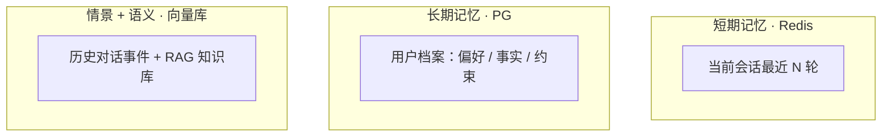
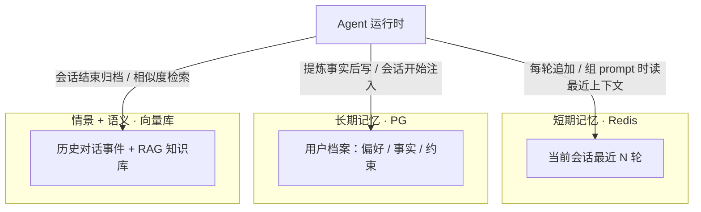
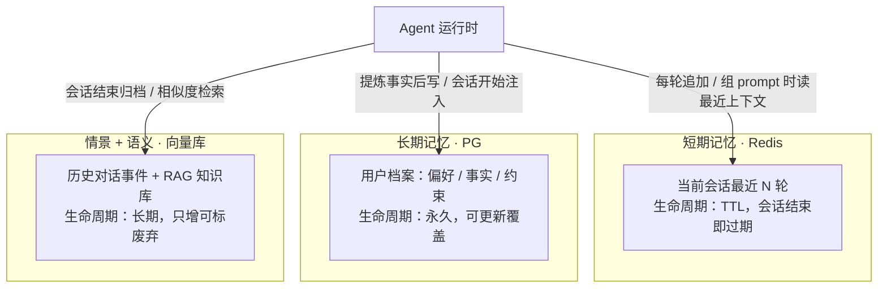

# 第 17 周 · Day 1：记忆四分类——让 Agent 从失忆到记得你

> 对应手册任务：学习「记忆分类：短期/长期/情景/语义」，动手画出三层记忆架构图：Redis（短期）+ PG（长期）+ 向量库（语义），当日产出一张「记忆架构图」。本篇只解决一个问题：第 12 周的 checkpoint 只会把对话原样存下来、原样放回去，轮数一多上下文爆炸，换个会话就彻底失忆，今天借认知科学的四类记忆，把「Agent 记住用户」这件事拆成能落地的三层存储。

## 今日目标

1. 说得清 checkpoint 的两个痛点：会话内上下文爆炸，会话间完全失忆
2. 掌握认知科学四分类到 Agent 组件的映射：短期→对话窗口、长期→用户档案、情景→历史对话、语义→知识库
3. 独立画出三层记忆架构图（Redis + PG + 向量库），每层标注承载的记忆类型、读写时机、生命周期，并用矩阵表逐项自查

## 概念讲解：为什么 checkpoint 不够用

第 12 周给 Agent 装上 checkpoint 之后，对话中断能恢复，看起来它已经「有记性」了。做两个思想实验，这个错觉马上破掉。

实验一，会话内爆炸。用户和 Agent 连聊 80 轮，checkpoint 的机制是把历史消息原样存、原样放：第 81 轮发问时，前面 80 轮一个字不少全部塞回模型。token 账单跟着轮数线性起飞，而其中大部分内容对当前这一问毫无用处。checkpoint 本质是对话流水账的「原样回放」，不会挑重点，不会做总结，更不会忘。

实验二，会话间失忆。昨天用户说过「我对花生过敏」，今天新开一个会话问「晚饭吃什么」，Agent 兴致勃勃推荐宫保鸡丁。这不怪它：模型本身无状态，checkpoint 绑定在单个会话线程上，换线程一切从零。它从头到尾没有「这个用户是谁」的概念。

两个实验合起来就一句话：会话内记太多，会话间记不了。这样的人像谁？像一位能逐字背诵你们今天聊天记录的朋友，却不记得你的名字、你的口味、上周和你说过的每句话。

人脑显然不这么干活。认知科学早就把记忆切成了四类，每一类都能在 Agent 里找到对应物：

- **短期记忆（工作记忆）**：心算时临时攥着的数字，几秒就散。对应对话窗口，只装当前会话最近几轮
- **长期记忆·事实**：老朋友的生日和忌口，稳定、可陈述。对应用户档案：偏好、约束、关键事实
- **长期记忆·情景**：上周三那次聊搬家的对话，是「我经历过的事」。对应历史对话事件，可检索回忆
- **长期记忆·语义**：知道花生是常见过敏原，这句话和谁说的无关。对应知识库，也就是 RAG

先把一张底牌亮出来：语义记忆你第 14 周就已经做完了，RAG 知识库就是一个不折不扣的语义记忆。所以本周不是从零造四样东西，而是把缺的三块补上，再把已有的那块归位到统一框架里。前 16 周攒下的存储组件，从这周开始重新拼装。

## 核心知识

本节的表格替代了往常的代码块，是今天画图的全部依据，动手前建议通读一遍。

### 1. 四类记忆，一张映射表

| 记忆类型 | 人脑里的样子 | Agent 里的样子 | 现状 |
|---|---|---|---|
| 短期（工作记忆）| 心算时攥着的数字 | 当前会话最近 N 轮对话窗口 | checkpoint 里有，但缺裁剪 |
| 长期（事实）| 记得朋友的生日和忌口 | 用户档案：偏好 / 事实 / 约束 | 本周用 PG 新建 |
| 情景（经历）| 记得上周聊过搬家 | 历史对话事件，可检索回忆 | 本周进向量库 |
| 语义（知识）| 知道花生是常见过敏原 | RAG 知识库 | 第 14 周已建 |

四行里最容易被搅在一起的是情景和语义，多说两句。情景记忆的主语是「我」：带时间、带当事人、带上下文，「用户上周说他搬家了」是情景。语义记忆和经历者无关：「花生是常见过敏原」对谁都成立。区分它们不是学院趣味，直接决定第三层怎么设计检索，坑 4 还会回头讲。

另外注意第一行的措辞：checkpoint 里「有」对话消息，但缺两样东西——轮数裁剪（所以爆炸），跨会话能力（所以失忆）。把这两样补齐，才配叫短期记忆层。

### 2. 三层存储：每层放什么、读什么

四类记忆落进三个存储层，语义和情景共用向量库。这就是今天要画的架构，先用一张矩阵表把它说死：

| 存储层 | 承载记忆 | 放什么 | 读什么 | 何时写 | 何时读 | 生命周期 |
|---|---|---|---|---|---|---|
| Redis | 短期 | 当前会话最近 N 轮消息 | 最近对话上下文 | 每轮对话后追加 | 组装 prompt 前 | TTL，会话结束即过期 |
| PG | 长期 | 提炼后的用户事实档案 | 「用户是谁」的稳定信息 | 从对话提炼出事实时 | 会话开始注入 + 需要时查询 | 永久，可更新覆盖 |
| 向量库 | 情景 + 语义 | 历史对话的 embedding、知识库文档 | 相似场景回忆、知识片段 | 会话结束归档 | 语义检索命中时 | 长期，只增可标废弃 |

三个层各有一个必须守住的设计决定。

Redis 层，靠 TTL 和截断守住「会忘」。短期记忆的全部价值就是容量小、用完即丢：TTL 保证会话凉了数据跟着凉，截断保证读回来时只有最近 N 轮。两个阀门少一个，Redis 就退化成第二个 checkpoint 垃圾场。

PG 层，只放提炼后的事实。存「花生过敏」这条结构化记录，不存用户说这句话时的那 20 轮原文。原文在向量库自有去处，档案只要结论。这样档案才能直接拼进 prompt；哪天用户说「过敏好了」，更新就是覆盖一条记录的事。

向量库层，是回忆不是背诵。历史对话转成 embedding 存进去，检索时按相似度捞最相关的几段，而不是全量重放。它和第 14 周的知识库同居一个存储，但两块数据必须能区分开，具体做法见坑 4。

### 3. 和 checkpoint 的关系：互补，不是替代

| 维度 | checkpoint（第 12 周）| 记忆（本周）|
|---|---|---|
| 绑定对象 | 会话线程 | 用户 |
| 存什么 | 运行状态：消息、工具调用轨迹 | 提炼后的信息：事实、事件、知识 |
| 目的 | 同一个对话中断后能续命 | 不同对话共享认知 |
| 生命周期 | 随会话 | 跨会话 |

一句话记住分工：checkpoint 让对话接着聊，记忆让 Agent 越用越懂你。运行时的完整流程是三层协同——会话开始，从 PG 注入用户档案；每轮应答，读写 Redis 的最近上下文；会话结束，把值得留的提炼进 PG、原文归档进向量库。checkpoint 在这一切底下继续负责中断恢复，谁也不抢谁的活。

## 动手任务：三层记忆架构图一步一步

手册任务：画出 Redis（短期）+ PG（长期）+ 向量库（语义/情景）三层记忆架构图。拆成 5 步，全程约 20 分钟。工具二选一：mermaid 快、能进版本库、VitePress 直接渲染；Excalidraw 手绘风、适合给人讲。建议 mermaid 起稿定结构，有汇报需求再精修一版。

**第 1 步：建文件。** 在本周练习目录新建 `memory-architecture.mmd`。下面每一步的代码都往这个文件里加，画完它就是当日产出。

**第 2 步：立起三个存储框。** 先不管箭头，把三层按「离 Agent 的远近」从上往下摆：短期最近在最上，长期居中，向量库垫底。

**第 3 步：加 Agent 和读写箭头。** Agent 画在最顶上，对每层各画一条双向标注的箭头，标签写清动作和时机，时机全部来自矩阵表，不要发明新动作：

六组读写动作画完后，拿矩阵表逐行核对：每个「何时写」「何时读」在图上都能找到对应的箭头吗？找不到就补，多余的就删。

**第 4 步：标注生命周期，得到终稿。** 给每个存储框补上第二行——Redis 加「TTL，会话结束即过期」，PG 加「永久，可更新覆盖」，向量库加「长期，只增可标废弃」。标生命周期不是装饰，它回答「这层数据什么时候死」，是本周写代码时 TTL 参数和清理策略的直接依据。终稿：

**第 5 步：四问自查。** 对着终稿问自己：每层标了承载的记忆类型吗？每个箭头标了读写时机吗？每层标了生命周期吗？情景和语义在向量库里画成可区分的两块了吗？最后一问如果答否，把向量库节点拆成上下两行（终稿的写法），或加一条注释说明实现时用 metadata 区分。

::: tip 画图工具
mermaid 版存 `.mmd` 或直接嵌进 markdown，能进 git、能 diff，是本周的施工图；Excalidraw 版画三色横条堆叠、Agent 居顶、实线箭头表示读、虚线表示写，导出 PNG 放周报里最直观。两版各画一遍不超过 30 分钟。
:::

## 常见踩坑

**坑 1：想拿记忆替代 checkpoint（或反过来）。** 两个方向都有人踩。删掉 checkpoint 只留记忆，多轮工具调用的中间状态和中断恢复就没了，Agent 一打断就废；只留 checkpoint 不做记忆，就是开篇那两个思想实验。判断标准一句话：对话内的运行状态归 checkpoint，跨会话的认知归记忆，两边是叠加关系。

**坑 2：把原始对话直接塞进 PG 当长期记忆。** 档案要的是「花生过敏」四个字，不是那 20 轮聊天记录，原文的去处是向量库。塞错了付两笔代价：档案膨胀到没法直接拼进 prompt；事实更新时（用户改口说「过敏好了」）你面对两段互相矛盾的原文，没法合并。长期记忆必须过「提炼」这道工序，这是它和 checkpoint 最本质的分界线。

**坑 3：Redis 不设 TTL、不截断轮数。** 短期记忆的全部意义就是会忘。不设 TTL，Redis 里堆着三个月前的死会话，它就成了第二个垃圾场；不截断 N，读回时上下文爆炸原样复发。N 取多少不是拍脑袋：10 到 20 轮起步，拿第 16 周建的评估集去量不同 N 下的答案质量，让数据替你选。

**坑 4：情景和语义在向量库里不分家。** 同一个库两类数据，用户问「我上次提过什么需求」，检索结果里混进一堆知识库科普文档，体验直接崩掉。最低成本的防线是给每条向量挂 metadata：`source: conversation` 或 `source: knowledge`，检索时按需过滤。图上画成一个框两个区，实现时就是 metadata 过滤的区别。

**坑 5：把图当一次性作业。** 这张架构图是本周每天的施工蓝图，代码一动它就得跟。周中你大概率会发现 PG 档案要加「事实更新时间」字段来处理冲突，发现就该回图上补一行。我的判断标准：图和代码差一次，是代码没跟上；差三次，就是图错了，重画。

## 自测问题

先自己答，再展开对照。答不上来的，回对应小节看一遍。

1. checkpoint 和记忆的核心区别是什么，各解决什么问题？

::: details 参考答案
checkpoint 是对话恢复机制，绑定会话线程，存运行状态（消息、工具调用轨迹），目的是同一个对话中断后能续命。记忆是跨会话知识，绑定用户，存提炼后的信息（事实、事件、知识），目的是让不同对话共享认知、越用越懂用户。两者互补不是替代，运行时叠加使用。
:::

2. 情景记忆和语义记忆都放向量库，怎么区分？

::: details 参考答案
情景是「我经历过的事件」，带时间和当事人，来源是历史对话；语义是世界知识，和经历者无关，来源是知识库文档。实现上给每条向量挂 metadata（`source: conversation` / `source: knowledge`）或分 namespace，检索时按需过滤，避免互相污染结果。
:::

3. 为什么长期记忆必须提炼后入库，不能存对话原文？

::: details 参考答案
档案要能直接注入 prompt，还得可更新。原文有两个致命点：体积大，拼进上下文等于换个地方爆炸；事实变更时两段原文互相矛盾，无法合并。提炼成结构化事实后，读是一条记录，更新是覆盖一条记录。
:::

4. Redis 层的 TTL 和轮数截断分别防什么？

::: details 参考答案
TTL 防跨会话的垃圾堆积，会话结束数据跟着过期，守住「该忘就忘」；截断防单会话内读回时上下文爆炸，只保留最近 N 轮。两个阀门分别对应「会话间失忆需求」和「会话内不爆炸需求」，少一个 Redis 就退化成第二个 checkpoint。
:::

5. 四类记忆里哪一类其实已经实现过了？在哪一周？

::: details 参考答案
语义记忆。第 14 周建的 RAG 知识库就是完整的语义记忆实现：知识文档进向量库，按语义相似度检索。本周只是把它归位到记忆框架里，并让它和情景记忆在同一个向量库里可区分地共存。
:::

## 延伸阅读

- [LangGraph Memory 官方文档](https://langchain-ai.github.io/langgraph/concepts/memory/)，框架对短期/长期记忆的官方切分方式，和本篇四分类对照着读，看官方少了哪一层
- [A Survey on the Memory Mechanism of LLM-based Agents](https://arxiv.org/abs/2404.13501)，记忆机制综述论文，四分类之外更细的划分，想深挖再读
- [mermaid flowchart 语法](https://mermaid.js.org/syntax/flowchart.html)，今天画图用到的全部语法，subgraph 和边标签两节重点看

今天的产出 `memory-architecture.mmd`（和可选的 Excalidraw 版）留好，这是本周的施工蓝图：接下来几天会把它一层层变成真代码，Redis 对话窗口、PG 用户档案、向量库情景检索依次落地，进度对照[本周计划](/week17/)推进。从[第 1 周](/week01/)的 `createResponse<T>` 走到今天的记忆架构，零件早已齐备，这周正式拼装。
