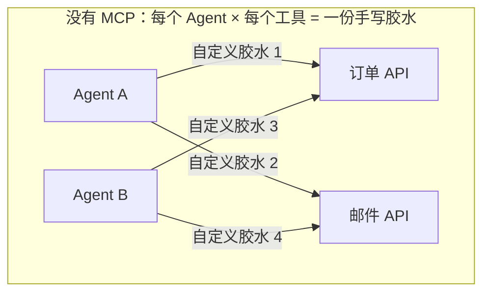
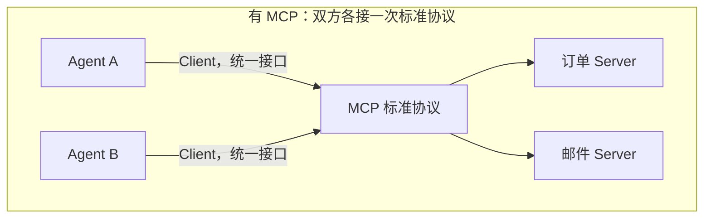
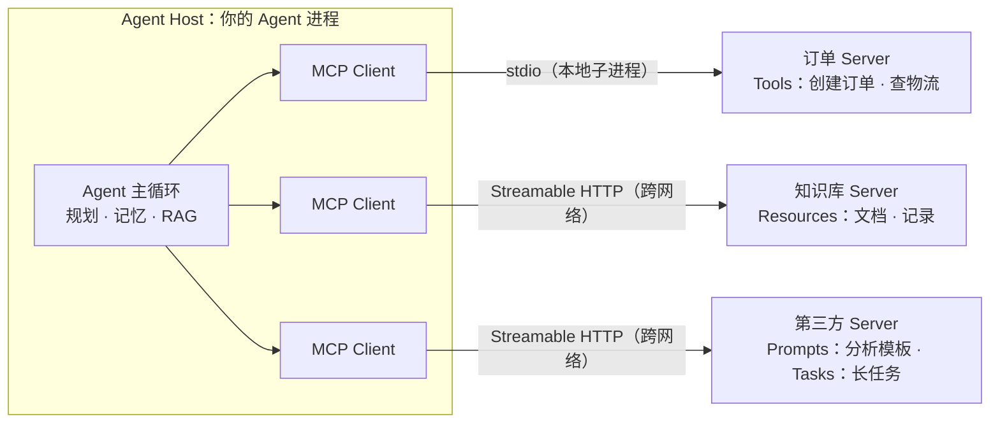

# 第 18 周 · Day 1：MCP 协议全景——把工具接入升级为标准协议

> 对应手册任务：学习「MCP 协议概念：Client/Server、Resources/Tools/Prompts」，动手画出 MCP 架构图，理解「Agent 作为 Client，业务 API 作为 Server」，当日产出一张 MCP 架构图。本篇只解决一个问题：此前每给 Agent 接一个工具就要手写一份胶水代码，工具和 Agent 一多，胶水数量按乘法膨胀，MCP 把这件事变成一套统一协议，接入成本从 N×M 降回 N+M。今天不写代码，只建模型：角色、原语、与你已有代码的关系，最后落在一张图上。

## 今日目标

1. 说得清 MCP 解决什么问题，为什么 N×M 会变成 N+M
2. 记住三组概念：三种角色（Host/Client/Server）、三大原语（Tools/Resources/Prompts）、两次边界（进程内工具 → 跨进程协议）
3. 画出一张自己业务的 MCP 架构图：Agent Host 内嵌 Client，通过 stdio 或 Streamable HTTP 连到订单、知识库等 Server，并对照要素清单自查通过

## 概念讲解：为什么需要 MCP

先看第 12/13 周我们是怎么加工具的：写一个函数，挂上 `@tool`，Agent 主循环里模型决定调用，函数在同一个进程里直接执行。这条路没问题，但它有个隐含前提——工具和 Agent 住在同一个代码库里。

一旦工具要跨项目复用，麻烦就来了。你的订单系统想让 Agent A 用，也想让 Agent B 用；Agent A 除了订单还想用邮件、日历、物流查询。每个 Agent 框架的工具有自己的定义格式，每个业务系统有自己的 API 风格，两边一对齐就得写一份胶水代码。2 个 Agent × 3 个工具是 6 份胶水，3 个 Agent × 4 个工具就是 12 份，数量按乘法涨，而且每份都不一样：



这就是工具生态的 N×M 问题。MCP（Model Context Protocol）的解法是给「Agent 怎么发现工具、描述工具、调用工具」定一套开放标准：工具方把自己的能力包装成 MCP Server，实现一次；Agent 方内置 MCP Client，接入一次。此后加一个 Agent 或加一个工具，成本都是 1，总账从 N×M 变成 N+M：



这就是 MCP 常被比作「AI 工具生态的 USB-C」的原因：外设不用为每台电脑定制一种接口，电脑也不用为每个外设开一种槽，中间隔着一个公版协议。MCP 由 Anthropic 于 2024 年 11 月开源，如今官方 SDK 每月下载量已达数亿次，主流模型厂商和客户端均已跟进，是事实上的行业标准。本周要把「工具接入」从手写代码升级到这个协议上。

## 核心知识

本节是纯概念，不跑代码。SDK 层面的写法从[本周 Day 2](/week18/) 开始展开，今天先把地图画对。

### 1. 三种角色：Host、Client、Server

MCP 世界里只有三个角色，方向千万别搞反：

| 角色 | 是什么 | 在你的系统里对应谁 |
| --- | --- | --- |
| Host | 宿主应用，承载 Agent 的整个进程 | 你的 Agent 程序（主循环 + 记忆 + RAG 都在里面） |
| Client | 协议客户端，Host 内置的连接器 | SDK 里的连接对象，一个 Client 负责一条到 Server 的连接 |
| Server | 工具提供方，把业务能力标准化地暴露出来 | 订单服务、知识库、任何第三方工具服务 |

三条关键理解：

第一，「Agent 作为 Client，业务 API 作为 Server」。不跑模型的那方是 Server，它只提供能力；发起工具调用的那方在 Client 侧。刚接触的人容易按「服务器更强」的直觉把方向想反。

第二，Client 住在 Host 里面，不是一个独立部署的东西。Host 想连三个 Server，就内置三个 Client，一对一各管各的连接。你在代码里感知不深，因为官方 SDK 把 Client 包装得很好。

第三，Server 不只服务你一个 Agent。订单 Server 包装一次，公司里所有 Agent、甚至支持 MCP 的第三方客户端都能连它，这才是 N+M 的兑现时刻。

### 2. 三大原语：Tools、Resources、Prompts

Server 能暴露的能力分三类，各自回答一个不同的问题：

| 原语 | 类比 | 谁来触发 | 典型例子 |
| --- | --- | --- | --- |
| Tools | 函数调用，有副作用 | 模型决定（通常要用户确认） | 创建订单、发邮件、重启服务 |
| Resources | 只读数据源 | 应用代码控制 | 配置文件、知识库文档、数据库记录 |
| Prompts | 预置提示模板 | 用户主动选用 | `/分析销售数据`、`/总结会议记录` |

**Tools 是可执行操作**，本质就是函数：有名字、有描述、有参数 schema，模型看完描述决定要不要调、传什么参数。它和第 12/13 周的 `@tool` 在概念上完全同构，区别只在调用边界，下一小节展开。

**Resources 是只读数据源**，对应文件、记录这类不该被模型「执行」的东西。注意它和 RAG 的关系：你的知识库文档作为 Resource 暴露出来，应用代码在合适的时机读出来塞进上下文，这正好接上第 8 周学过的检索链路。

**Prompts 是预置提示模板**，由工具方维护、用户主动挑用的半成品 prompt。比如数据分析团队在 Server 上放一个「销售分析」模板，用户在客户端敲 `/销售分析` 就能拿到填好框架的对话起点。

为什么非要分三类，全做成 Tools 不行吗？不行，因为触发方决定了信任级别和成本模型：模型触发 Tools 意味着每次调用都可能改变外部世界，所以要确认、要审计；应用触发 Resources 则可以放心预取和缓存；用户触发 Prompts 是明确的授权动作。三者混着用，权限就没法管，上下文成本也控制不住。

### 3. 与第 12/13 周 @tool 的关系：能力不变，边界升级

回顾一下进程内工具的样子（示意，完整版见第 12 周笔记）：

```ts
// 进程内工具：函数签名就是工具描述，Agent 直接函数调用
const createOrder = defineTool({
  name: "create_order",
  description: "为用户创建订单",
  params: { userId: "string", sku: "string" },
  run: async ({ userId, sku }) => orders.create(userId, sku),
});
```

换成 MCP 之后，`name`、`description`、参数 schema 这三件套原样保留，模型看到的工具描述没有变化。变的只有一件事：`run` 函数不再和你同进程，它在 Server 进程里执行，中间隔着一次跨进程或跨网络的协议调用。Agent 通过 Client 发出一次 `tools/call` 请求（示意）：

```json
{
  "jsonrpc": "2.0",
  "id": 1,
  "method": "tools/call",
  "params": {
    "name": "create_order",
    "arguments": { "userId": "u-001", "sku": "MBP-14" }
  }
}
```

所以别把 MCP 理解成「更强的工具」，它没有带来任何新能力，它带来的是新的边界：从函数调用边界升级到协议边界。这带来三个实际收益——工具可以独立部署独立迭代、可以跨语言（Server 用 Python 写、Host 用 TypeScript 写毫无障碍）、可以跨团队复用。同时也带来三个成本：序列化开销、网络往返、多一层运维。判断标准很简单：工具和 Agent 同进程同团队，`@tool` 够用就别上 MCP；工具要跨团队、跨语言、给多个 Agent 共享，MCP 才是正解。

### 4. 规范演进：三个时间点

MCP 规范迭代很快，学习资料鱼龙混杂，先把时间线钉住：

- **2024-11-05 初版**：Anthropic 开源，定义了 Client/Server 模型与三大原语，传输用 stdio 和 HTTP+SSE
- **2025-03-26：Streamable HTTP** 取代 HTTP+SSE，一个端点同时支持请求响应和流式推送
- **2026-07-28：无状态化**，改动最大的一版：`initialize` 握手与 `Mcp-Session-Id` 会话机制移除，请求自带所需元信息，HTTP 层引入 `Mcp-Method`、`Mcp-Name` 等头部做路由；旧 HTTP+SSE 传输正式废弃；Roots、Sampling、Logging 列入废弃清单；新增 Tasks（长任务原语，提交后异步查询进展）和 MCP Apps 扩展

::: warning 版本红线
网上大量教程还停留在旧版：开头就教你 `initialize` 握手、盯着 `Mcp-Session-Id` 管会话，这些在 2026-07-28 之后都已成历史。看到这类内容先对一眼时间线，别按旧规范理解协议。好消息是实操用官方 SDK，握手、路由、消息格式这些协议细节 SDK 全部屏蔽，你写的代码在新旧规范下的差异远比想象中小。
:::

## 动手任务：画出你自己的 MCP 架构图

手册任务：画一张 MCP 架构图，体现「Agent 作为 Client，业务 API 作为 Server」。拆成 5 步，全程约 20 分钟，产出存为 `mcp-architecture.md`（含 mermaid 图和要素清单）。

**第 1 步：画 Host 边界。** 先画一个大框，标上「Agent Host：你的 Agent 进程」。框里放 Agent 主循环（规划、记忆、RAG 都画进来）。这一步的意义是提醒自己：Client 是长在 Host 里面的，不是独立服务。

**第 2 步：放 Client 和 Server。** Host 框里画三个 MCP Client，框外画三个 Server：订单、知识库、任选一个第三方。每个 Client 用一根线连一个 Server，严格一对一。

**第 3 步：连线标传输。** 本地同机的 Server 标 stdio（子进程方式，零网络开销），跨网络的标 Streamable HTTP。传输选型就这一条判断：是否跨机器。

**第 4 步：给每个 Server 标原语。** 订单 Server 标 Tools（创建订单、查物流），知识库 Server 标 Resources（文档、记录），第三方 Server 可以标 Prompts（分析模板）和 Tasks（长任务）。一台 Server 允许同时提供多种原语。完成后应该长这样：



**第 5 步：对照要素清单自查。** 逐条打勾，缺哪条补哪条：

- Host 边界是一个封闭框，Client 全部画在框内
- Client 与 Server 一对一连线，没有一根线跨接多个 Server
- 每根连线标了传输方式（stdio 或 Streamable HTTP）
- 每个 Server 至少标了一种原语（Tools/Resources/Prompts）
- 箭头方向从 Agent 指向 Server（Agent 是调用发起方）
- 图里没有出现 `initialize`、`Mcp-Session-Id` 这类旧协议元素

前三步搭骨架，后两步定细节。画完后把图拿给别人看，不解释对方也能说出「谁调用谁、用什么传、拿到什么」，这张图就算成了。

## 常见踩坑

**坑 1：把 MCP Server 当成「跑模型的机器」。** Server 这个词的直觉容易带偏人。MCP 里 Server 恰恰是不含模型的一方，它只是能力的提供者；有模型、做决策、发请求的 Agent 侧才是 Client 一边。记住方向：Agent 作为 Client，业务 API 作为 Server。

**坑 2：学了 MCP 就想把所有 @tool 都迁移过去。** 协议不是免费的：序列化、网络往返、独立部署，样样是成本。同一个进程里的工具函数，直接调用永远比走协议快。MCP 解决的是复用与边界问题，不是性能问题。我的判断标准和第 3 小节一致：跨团队、跨语言、多方共享才值得上，否则 `@tool` 继续用。

**坑 3：三大原语混着用。** 最常见的错是把只读查询写成 Tool：模型每次都要「决定」调用，不稳定还浪费一次工具轮次。数据是拿来读的就用 Resources，交给应用代码控制；模型要动手改世界才用 Tools；用户主动发起的固定玩法交给 Prompts。触发方定原语，这条线想清楚就不会错。

**坑 4：按旧教程学协议细节。** 2026 年之前的文章几乎都围着 `initialize` 握手和 `Mcp-Session-Id` 会话展开，新规范里这些已经移除，换成请求自带元信息和 `Mcp-Method`、`Mcp-Name` 头部路由。遇到老资料先看发布日期，再对照第 4 小节的时间线定位它讲的是哪个版本。用 SDK 时这些差异大多被屏蔽，但你得知道差异存在，排查问题时不至于拿着旧概念对不上现实。

**坑 5：传输方式选错。** stdio 只适合本地子进程场景，跨机器必须 Streamable HTTP。另外别再碰 HTTP+SSE 传输，它已正式废弃，老示例代码里见到直接替换。选型一句话：同机 stdio，跨网 Streamable HTTP，没有第三选项。

## 自测问题

先自己答，再展开对照。答不上来的，回对应小节看一遍。

1. N×M 问题是什么？MCP 怎么把它变成 N+M？

::: details 参考答案
没有标准协议时，N 个 Agent 框架 × M 个工具系统，两两之间各写一份胶水代码，共 N×M 份，新增任何一方都要补一整排。MCP 让工具方实现一次 Server、Agent 方接入一次 Client，双方只和协议对接，总成本变成 N+M。类比 USB-C：接口标准化后，外设和电脑各做一次适配。
:::

2. Host、Client、Server 各是什么？Client 和 Host 是什么关系？

::: details 参考答案
Host 是宿主应用，即你的 Agent 进程，装着主循环、记忆、RAG；Client 是 Host 内置的协议客户端，负责与一个 Server 的一条连接的收发；Server 是工具提供方，把业务能力包装成标准原语。Client 不是独立部署的服务，它长在 Host 里面，一个 Host 连几个 Server 就内置几个 Client，严格一对一。
:::

3. 「查询用户的历史订单记录」应该做成哪个原语？为什么？

::: details 参考答案
Resources。历史订单是只读数据，不该由模型决定何时执行，而是由应用代码在需要时读取并放进上下文（正好衔接 RAG 的检索链路）。Tools 留给有副作用的操作，比如「创建订单」「取消订单」这类真正要模型动手的动作。
:::

4. MCP 的 Tools 和第 12 周的 @tool 本质区别是什么？什么时候不该用 MCP？

::: details 参考答案
本质区别只在调用边界：@tool 是进程内函数调用，MCP Tools 是跨进程、跨网络的标准协议调用；工具的 name、description、参数 schema 三件套完全同构，能力没有任何变化。工具和 Agent 同进程同团队、性能敏感、无跨语言需求时，不该为协议付序列化和网络成本，继续用 @tool。
:::

5. 2026-07-28 的规范做了哪几件大事？

::: details 参考答案
协议无状态化：移除 initialize 握手与 Mcp-Session-Id 会话，请求自带所需元信息；HTTP 层引入 Mcp-Method、Mcp-Name 等头部路由；旧 HTTP+SSE 传输正式废弃；Roots、Sampling、Logging 列入废弃清单；新增 Tasks 长任务原语与 MCP Apps 扩展。看到讲 initialize 或会话 ID 的教程，即可判定是此前的旧版内容。
:::

## 延伸阅读

- [MCP 官网](https://modelcontextprotocol.io)，协议官方文档，概念讲解与各类 SDK 入口都在这里，本周的主要参考源
- [MCP 规范全文](https://modelcontextprotocol.io/specification)，各版本协议的权威文本，想确认某个机制是否还在，以这里的最新版为准
- [Anthropic 发布公告](https://www.anthropic.com/news/model-context-protocol)，2024 年 11 月开源时的公告原文，看它最初如何定义「AI 应用的开放标准」

今天画好的这张架构图留好，从[本周 Day 2](/week18/) 起开始真正写 Server 和 Client 代码，每写一步都回头对照这张图，确认代码落点和你图上的角色一一对应。
