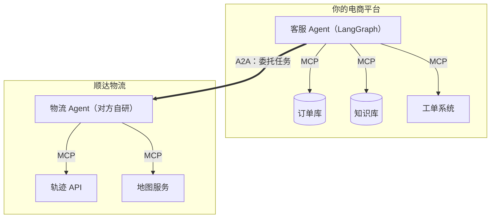
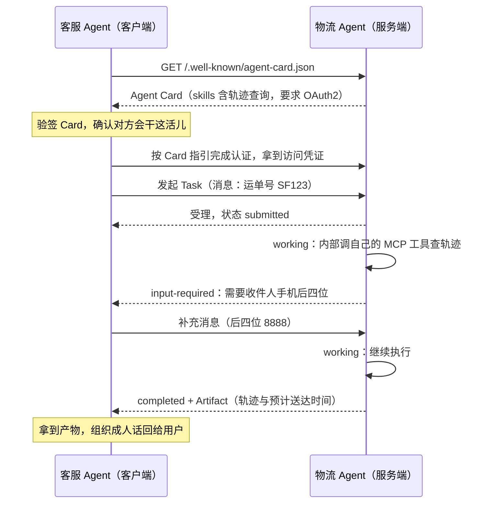

# 第 19 周 · Day 4：A2A 协议——让 Agent 之间能互相委托任务

> 对应手册任务：学习「A2A 协议：与 MCP 的分层（纵向工具集成 vs 横向 Agent 协作）、Agent Card、华为/腾讯落地案例」，动手「画一张 MCP + A2A 组合架构图，设计两个 Agent 间 A2A 任务委托的时序图」，当日产出「协议分层架构图」。本篇只解决一个问题：MCP 已经把你的 Agent 和工具接通（纵向），但当任务只有「别人家的 Agent」才能完成时，跨组织、跨框架的互调没有标准——A2A 补的就是这块横向拼图。

## 今日目标

1. 说得清 A2A 解决什么问题，以及它和 MCP 的分层关系：纵向接工具，横向找 Agent
2. 掌握三个核心概念：Agent Card（能力发现）、Task（委托的工作单元与生命周期）、消息与产物交换
3. 画两张图：MCP + A2A 组合架构图、客服 Agent 委托物流 Agent 的任务时序图。今天不写代码——协议 v1.0 落地才半年，SDK 演进快，概念与设计能力先行，面试时把分层讲明白即达标

## 概念讲解：为什么需要 A2A

接着本月的连续剧讲。你是电商平台的客服 Agent，MCP 已通，工具箱里有订单库、知识库、工单系统，前三天还给它加过护栏（[Day 3](/week19/day3)）。今天用户问：「我的包裹到哪了？」轨迹数据在物流公司的内网里，你的工具箱够不着。

没有 A2A 时你只有两条路。

第一条路，找物流公司开 API 自己对接。一家一套对接方式，十家物流就是十套，对方一改版你就跟着连环改。

第二条路，让物流公司把能力包成 MCP Server 挂到你的 Agent 上。能跑通，但很快会别扭：对面其实是个 Agent，有来有回的对话、动辄几分钟的长任务、干到一半还要人补充信息。硬把它压成「工具」，这些状态全丢了。更根本的问题是跨组织：你事先不知道对方有什么能力、要求怎么认证、活儿干到哪一步了。MCP 假定工具是你自己选的、你信任的；而跨组织协作里，双方是平等的陌生主体。

换个类比就看明白了。MCP 是员工的工具箱，员工再能干也只有一双手；A2A 是公司间的工单系统——你是甲方，把活儿连同要求发给乙方，乙方用自己的工具去干，干完交回产物。你们不必共享办公室，也不必了解对方的内部流程，只需要一份双方都认的工单格式。

A2A（Agent2Agent）就是这份工单格式。Google 在 2025 年 4 月发起，拉上几十家厂商；随后捐给 Linux 基金会，成立 AAIF 互操作基金会，和 MCP 先后进入 Linux 基金会体系，成了同门师兄弟；2026 年 3 月发布 v1.0。还有个值得注意的事实：落地第一波主力在亚洲，华为小艺、微信都在国内场景里跑起来了——这个协议的现实需求，很大程度是国内生态推着走出来的。

## 核心知识

### 1. Agent Card：Agent 的自描述名片

发现是协作的第一步。A2A 规定每个 Agent 在固定路径发布一张 JSON 名片：`/.well-known/agent-card.json`（早期版本叫 agent.json）。拉到这张卡片，你就知道：它是谁（name、description）、能干什么（skills）、端点在哪（url）、要求怎么认证（securitySchemes）、支不支持流式与推送（capabilities）。节选示意，以官方规范为准：

```json
{
  "name": "顺达物流 Agent",
  "description": "面向企业客户的物流服务 Agent",
  "url": "https://agent.shunda.example/a2a",
  "capabilities": { "streaming": true, "pushNotifications": true },
  "skills": [
    { "id": "track_package", "name": "包裹轨迹查询",
      "description": "按运单号返回全程轨迹与预计送达时间" }
  ],
  "securitySchemes": {
    "oauth2": { "type": "oauth2",
      "flows": { "clientCredentials": { "tokenUrl": "https://auth.shunda.example/token" } } }
  },
  "version": "1.0.0"
}
```

v1.0 给 Card 加了签名（JWS）。为什么要签？因为 Card 是你「要不要委托」的决策依据：攻击者要是能在中间把 skills 和 url 换掉，你就把用户数据发到了假端点。验签之后再谈委托，发现阶段就把这条堵死。

### 2. Task：委托的工作单元与生命周期

Task 是 A2A 的中心概念，客户端 Agent 发起的每一次委托就是一个 Task。生命周期是这样一条链：

```
submitted（已受理）→ working（执行中）→ completed（完成）/ failed（失败）/ canceled（取消）
                          ↘ input-required（需补充信息）→ 补充后回到 working ↗
```

三个要点值得单独说。

input-required 是「对面是个 Agent 而不是函数」的直接体现。对方干到一半发现缺信息——比如要做身份验证，要收件人手机后四位——就把 Task 挂起，等你补充后继续。普通函数调用没有「问你一句」这种事，Agent 协作天天有。

长任务别把连接挂死。working 可能持续几分钟，协议给了三种跟进方式：SSE 流式推进度、webhook 主动通知、HTTP 轮询兜底。设计时按任务时长选，别一律同步死等。

消息和产物要分开。Task 里过程性的来回叫 Message，带角色（user / agent），内容由文本、文件、结构化数据三种 Part 组成；最终交付的成果叫 Artifact。一句话记：谈过程用 Message，交货用 Artifact。

传输层记住一句就够：JSON-RPC over HTTPS，流式用 SSE，异步完成用 webhook 推。

### 3. 与 MCP 的分层：纵向 vs 横向

一张表说清两个协议的分工：

| 维度 | MCP | A2A |
| --- | --- | --- |
| 解决什么 | Agent 接工具、数据、提示词 | Agent 找 Agent 协作 |
| 方向 | 纵向：Agent 向下集成资源 | 横向：对等 Agent 互相委托 |
| 信任前提 | 工具是自己选的、可信的 | 对方跨组织，只暴露能力，不暴露内部 |
| 类比 | 员工的工具箱 | 公司间的工单 |

关键认识是：两层叠加，不是二选一。你的客服 Agent 向下用 MCP 接订单库和知识库；横向用 A2A 把「查轨迹」委托给物流 Agent；物流 Agent 接单后，向下再用它自己的 MCP 工具（轨迹 API、地图服务）干活。每一个 Agent 内部用什么框架、接了哪些工具，对对方完全不可见。这种不透明不是缺陷，恰恰是跨组织协作的前提——你不会把自己公司的内部系统摊开给合作方看，Agent 也一样。

### 4. 国内落地：需求主导的协议

华为小艺：鸿蒙系统里，小艺作为系统级入口，应用内 Agent 通过 A2A 与之互联。你对小艺说「帮我退掉昨天买的袜子」，小艺把任务委托给购物 App 里的 Agent 去执行，执行完把结果带回来。微信：把服务能力以 Agent 形式暴露出来，和各手机厂商的助手走 A2A 互通。

国内的「超级 App + 厂商助手」格局，天然就是跨组织委托的场景，所以 A2A 的第一波真实需求主要来自亚洲市场。这也解释了它为什么要捐给 Linux 基金会做中立化：不绑任何一家云厂商，几家巨头才敢共同押注。

## 动手任务：两张图，一步一步

今天不写代码。协议尚新，SDK 半年一个样，但「发现 → 委托 → 执行 → 回传」这个流程几年内不会变，今天练的就是把它画下来。用 Mermaid 画两张图，全程约 25 分钟。

**第 1 步：建文件。** 新建 `a2a-design.md`，两张图都放进这个文件，写完它就是当日产出「协议分层架构图」。

**第 2 步：画组合架构图。** 规矩只有一条：MCP 只准出现在 Agent 与工具之间，A2A 只准出现在 Agent 与 Agent 之间。



注意两个 subgraph 里各有一条 MCP 纵向链路，互不相干；中间那条横向粗箭头才是 A2A。同一个 Agent（你的客服 Agent）既是 MCP 的 Host，又是 A2A 的客户端，一人分饰两角——这就是「分层」的含义。

**第 3 步：画委托时序图。** 客服 Agent 是 A2A 客户端，物流 Agent 是 A2A 服务端，完整走一遍委托：



看一遍流程你就能对上前面三个概念：拉 Card 对应能力发现，submitted 到 completed 对应 Task 生命周期，中间那次来回对应 input-required，最后一行是 Artifact 交付。

**第 4 步：自查两张图。** 三条检查：MCP 的边是不是全部「Agent→工具」；A2A 的边是不是全部「Agent→Agent」；时序图里 Task 状态有没有从 submitted 一路走到 completed，input-required 是不是有去有回。任何一条不过，回去改图。

**第 5 步：讲一遍。** 对着图用 30 秒口述分层逻辑：「MCP 纵向接工具，A2A 横向找 Agent，物流 Agent 内部再用它自己的 MCP 干活，两层叠加」。讲不顺就说明图还没画明白——图是画给自己讲清用的，不是画给硬盘存的。

::: tip 渲染工具
Mermaid 在 GitHub、Typora、VS Code（装个插件）里都能直接渲染。想要更自由的排版就换 excalidraw 或 draw.io，但源文件建议用 Mermaid 文本存档，以后改起来最省事。
:::

## 常见踩坑

**坑 1：把 A2A 当成 MCP 的替代品。** 两个协议解决的问题不同：MCP 管 Agent 和工具，A2A 管 Agent 和 Agent。替代论可以当场反驳：本篇的组合架构图里，同一个 Agent 同时用两者，一层都少不了。面试被问「A2A 会不会取代 MCP」，答案就是这张图。

**坑 2：以为协作就得共享内部。** 有人担心委托之后对方能看到自己的记忆、提示词、工具清单。恰恰相反，A2A 的设计前提就是不透明：双方只交换消息和产物，内部实现各自保留。物流 Agent 用什么框架、查轨迹时调了哪个 API，你不知道也不需要知道。

**坑 3：Agent Card 拿来就用，不验签。** Card 决定了你把数据发给谁，它本身就是攻击面。v1.0 的 JWS 签名就是防中间篡改的，发现阶段先验签、再谈委托，一步不能省。

**坑 4：把 Task 当一次性 RPC 调用。** 同步等返回只适合几秒钟的短任务。长任务有 working 的漫长等待和 input-required 的人工介入，不做流式或轮询设计，请求会挂死，超时之后你连任务死活都不知道。

**坑 5：把两层认证混为一谈。** A2A 的认证是客户端 Agent 对服务端 Agent 的机器对机器认证（比如 OAuth2 的 client credentials），跟「用户登录你的客服系统」是两码事。跨组织委托要提前对着 Card 里的 securitySchemes 对齐，否则第一次发任务就是 401。

## 自测问题

先自己答，再展开对照。答不上来的，回对应小节看一遍。

1. MCP 和 A2A 各解决什么问题？为什么不能互相替代？

::: details 参考答案
MCP 解决 Agent 与工具、数据、资源的纵向集成；A2A 解决对等 Agent 之间的横向委托。不能替代：工具是被动的、可信的、自己选的；对方 Agent 是有状态的、跨组织的、能力要靠发现得知。组合架构里同一个 Agent 两层都要用——向下 MCP 接工具，横向 A2A 委托外部 Agent。
:::

2. Agent Card 是什么？放在哪？v1.0 为什么要给它加签名？

::: details 参考答案
Agent 的自描述名片，一份 JSON 文档，hosted 在 `/.well-known/agent-card.json`，写明身份、能力（skills）、端点、认证要求、传输能力。加签名是因为 Card 是委托决策的依据，被篡改（skills 和 url 被替换）会让你把数据发给假端点；JWS 签名保证 Card 防篡改，发现阶段先验签。
:::

3. Task 生命周期有哪些状态？input-required 意味着什么？

::: details 参考答案
submitted → working → completed / failed / canceled，外加 input-required。input-required 表示对方 Agent 执行中缺信息，把任务挂起等客户端补充，补充后回到 working 继续。它的存在说明对面是个会提问的 Agent，不是一次性执行的函数。
:::

4. 用 MCP 把远端 Agent 包成 Server 不行吗？差在哪？

::: details 参考答案
小规模能跑通，但丢三样东西：Agent Card 的能力发现（MCP 工具列表表达不了「这是个什么 Agent」）、Task 的生命周期（工具调用没有 input-required 和长任务跟进）、跨组织的对等信任模型。而且对方每次升级你都得改包装层。Agent 间协作走 A2A 才是标准姿势。
:::

5. 为什么 A2A 的第一波落地需求主要来自国内？

::: details 参考答案
国内的超级 App 加厂商助手格局（华为小艺、微信与手机厂商助手互通）天然就是跨组织委托场景：系统入口的 Agent 和应用内的 Agent 分属不同公司，谁也不肯把内部系统敞开给对方，恰好需要 A2A 这种「只交换能力与产物」的中立协议。
:::

## 延伸阅读

- [A2A 官方站点](https://a2aprotocol.ai)，协议规范与 Agent Card 文档的原始出处，v1.0 的权威描述都在这里
- [a2aproject/A2A（GitHub）](https://github.com/a2aproject/A2A)，Linux 基金会托管的主仓库，各语言 SDK 和示例代码，等你要动手实现时再来翻
- [MCP 官方文档](https://modelcontextprotocol.io)，对照着看纵向那层，两份规范放一起读，分层的体会比单看任何一份都深

今天的两张图留好。明天上 Dify（[Day 5](/week19/day5)）时回头想想：它的「工作流编排」操作的是哪一层——工具层还是 Agent 层？想清楚这个问题，今天的图就没白画。
